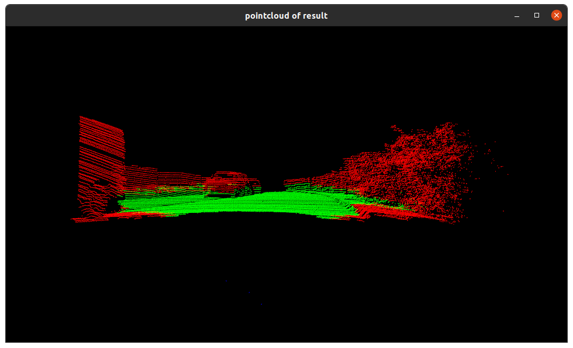

# lidar histogram

This repo is an implementation of the paper ["Lidar-histogram for fast road and obstacle detection"](https://doi.org/10.1109/ICRA.2017.7989159)(ICRA2017).

It uses Lidar-histogram to detect traversable road regions, positive and negative obstacles.

## Usage

### Requirements

We tested on Ubuntu 18.04.

- `cmake`
- `Boost`
- `Eigen`
- `PCL`
- `OpenCV`

### Build and run

```bash
mkdir build
cd build
cmake ..
make
./lidar_hist
```


